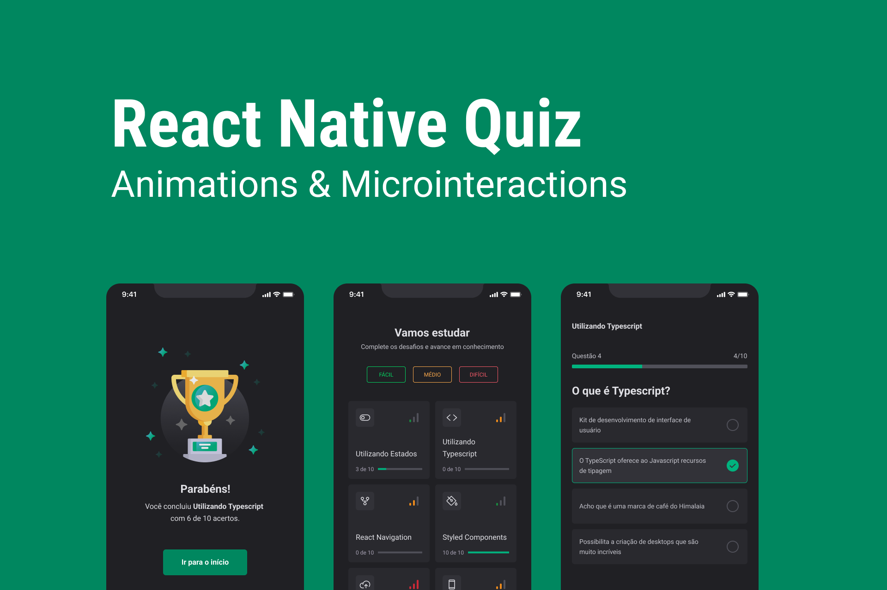

## :computer: Project

Quiz app in React Native focusing on animations and micro interactions.

<div align="center">
  <video src="https://user-images.githubusercontent.com/22561893/230719225-0eda7d9b-cab6-409a-a9f9-7ec8c1ec7ecd.MP4" width="400" />
</div>

## :rocket: Techs

- [x] [React Native](https://reactnative.dev)
- [x] [Expo](https://docs.expo.dev)
- [x] [TypeScript](https://www.typescriptlang.org)
- [x] [React Native Reanimated](https://docs.swmansion.com/react-native-reanimated)
- [x] [React Native Skia](https://shopify.github.io/react-native-skia)
- [x] [React Native Gesture Handler](https://docs.swmansion.com/react-native-gesture-handler/docs)
- [x] [Expo AV](https://docs.expo.dev/versions/latest/sdk/av)
- [x] [Expo Haptics](https://docs.expo.dev/versions/latest/sdk/haptics)

## :hammer_and_wrench: Features

- [x] Keyframe animation
- [x] Shake animation
- [x] Entry and exit animation
- [x] Rotate animation


- [x] Layout animation
- [x] Swipeable interaction
- [x] Fixed header on scroll up
- [x] SVG Path animation using Skia
- [x] Check animation using Skia
- [x] Audio as feedback
- [x] Vibration as feedback

## :gear: Run project

Install dependencies:

```bash
$ npm i
```

Run app:

```bash
$ npm run start
```
